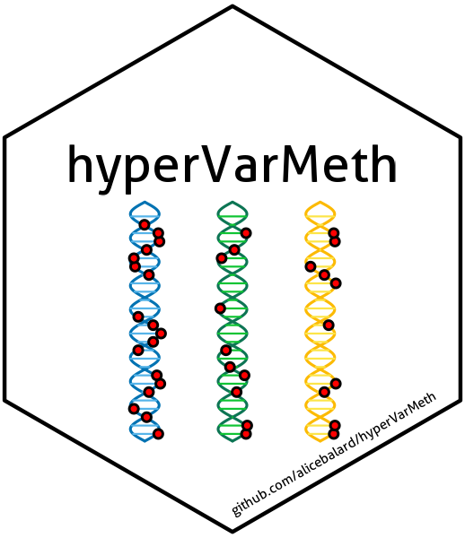

Package for hypermethylated sites detection in different datasets

The sticker was generated using
the [`hexSticker`](https://github.com/GuangchuangYu/hexSticker) package.

## How to install hyperVarMeth in R?

install.packages("devtools")

library(devtools)

install_github("alicebalard/hyperVarMeth")

## How to load hyperVarMeth?
library(hyperVarMeth)

## How to use hyperVarMeth?

See examples in vignettes
